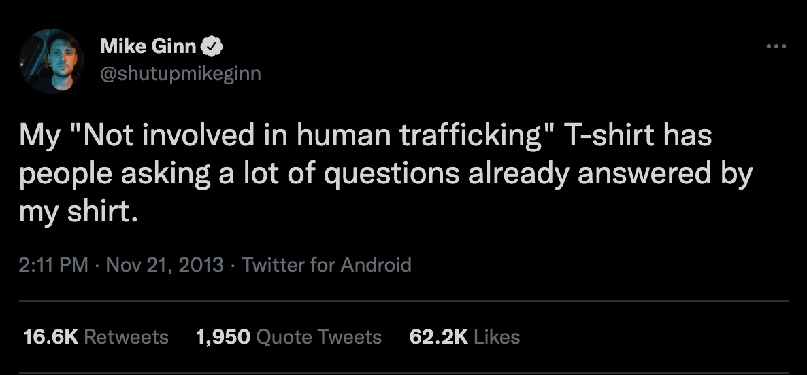

# The Ginn Retort

Guilt by deliberation is a conversational trap that I see deforming discourse. "Trap" may be too passive because it's more like a weapon, often wielded accidentally in good faith conversations, but destructively nonetheless. The basic pattern is that anyone who expresses any curiosity or opinion about some topic risks implying they have a personal stake or vested interest. This encourages neutral thinkers to adopt isolating and defensive conversational frames, or avoid the subject altogether. It also diverts the conversation in unproductive ways. I'd like to propose a firm and friendly counterattack.

I call it the Ginn retort in honour of Mike Ginn's masterpiece. This is not an example of the Ginn retort because he explicitly disavows involvement, but it identifies the problem and sets the right tone.

## Examples

### Associating with a group

If Alice discusses issues facing a particular group, she may find herself having to clarify her relationship. She may start sentences with:

- I'm not a member of **the group**, but...
- I know someone involved in **the group**, so I think that...
- I don't agree with most of **the group**'s assertions, but they're right about...

This is particularly tragic when the group is unfairly stigmatised, because even when Alice is supporting them, she is still distancing herself and reinforcing the stigma. To take a particular example, I recall a time when anyone who expressed strong opinions (on either side) about how society treats gay people was reliably accused of being a closet homosexual. Many commentators would, sometimes successfully, preempt these accusations with the appropriate disclaimers about being happily married or being sufficiently interested in sports. Gay people who had not revealed their sexuality either had to lie or deflect the question. Presumably, some would-be commentators remained silent to avoid the stigma. This dynamic suppresses open conversations and treats group membership as fundamentally important.

Even if the particular group is _fairly_ stigmatised or criticised, having to disclaim association before discussing their ideas is still a defensive stance. The conversation can be derailed at any point by someone suggesting that the advocate protests too much.

### Engaging in an activity

If Bob believes an activity should be more (or less) accepted in society, he singles himself out as someone who might engage in it. If the activity is currently illegal, having to clarify his involvement might be risky. For instance, whether or not they're morally correct, doctors who illegally practice euthanasia are somewhat protected by their colleagues who publicly advocate for it and don't disclose whether they're personally involved.

### Enforcing a process

If Charlie defends a process, he may be suspected of personally benefitting. Discussions around optimal governmental policy may focus on whether he individually profits. Insisting on the presumption of innocence or the right to a fair trial in a particular case may require disclaimers about his own innocence in other cases. If he criticises the criteria that a service provider uses to deny access to some customers, he may have to reveal whether he would also be denied under those criteria.

Whenever neutral arguments about processes could be assessed on their merits, discussions about personal involvement are often distracting and time consuming, and can discourage participation from the people most knowledgeable about the subject.

## My Response

I will occassionally adopt the following mindset and behaviours when discussing social issues. For my purposes, it makes sense to declare this in advance and encourage other people to do the same.

- exhibit a neutral disposition
    - the goal is to focus the conversation on the broader topic, not my involvement.
- **don't issue disclaimers**
    - whether I have a personal stake in the issue is not relevant and won't be addressed.
    - when I don't, I consider it honourable to leave ambiguity to provide cover for others.
    - being a Samaritan or [Sammy Lover](https://www.youtube.com/watch?v=OIVB3DdRgqU) is not a prerequisite to defend Samaritans. Even better if not.
    - I'm personally inspired by the several examples I saw in the 2000s of Sikhs handling anti-Muslim hatred with courage and compassion, despite having an easy escape hatch (ie. "This turban indicates I'm a Sikh, not a Muslim").
- express mild defiance to personal probes
    - in contrast to [pleading the fifth](https://www.merriam-webster.com/dictionary/take/plead%20the%20Fifth), which is defensive and implies guilt without confirming it, this should feel like a friendly repudiation.
    - everyone should understand the boundary without feeling insulted. We want to continue with a pleasant and productive conversation.
    - I may use the Ginn retort on behalf of people who are not in the conversation to help establish the social norm.
- unpredictability 
    - I may choose not use the Ginn retort whenever it applies.
    - I may apply it capriciously with no meaningful purpose in mind.
        - I may use it in situations where my involvement in the issue is already known.
    - randomness provides its own camouflage.
    - personal conversations are interesting and valuable and should not be eschewed reflexively.
    - passionate advocacy on personally relevant issues is compelling.
        - I don't want to discard a useful tool because it undermines another.
- this is not an excuse.
    - sometimes personal expertise is relevant.
    - sometimes conflicts of interest are relevant.
    - unearned defiance is cowardly.

This is basically the schoolyard "Nunyabusiness" or the governmental "I can neither confirm nor deny" response, but delivered defiantly and with an overall view towards promoting constructive conversations.

## If I referred you here...

Please appreciate:

- I'm not upset or embarrassed. I prepared this answer in advance as part of a conscious strategy to be able to credibly represent some positions that may contradict legality and the social zeitgeist, which probably has nothing to do with our conversation.
- I respect you enough as a good-faith thinker to believe an honest insight into my thought processes will improve our relationship, and that you will use the knowledge compassionately.
